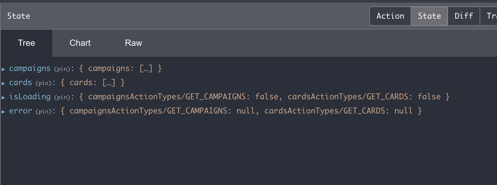
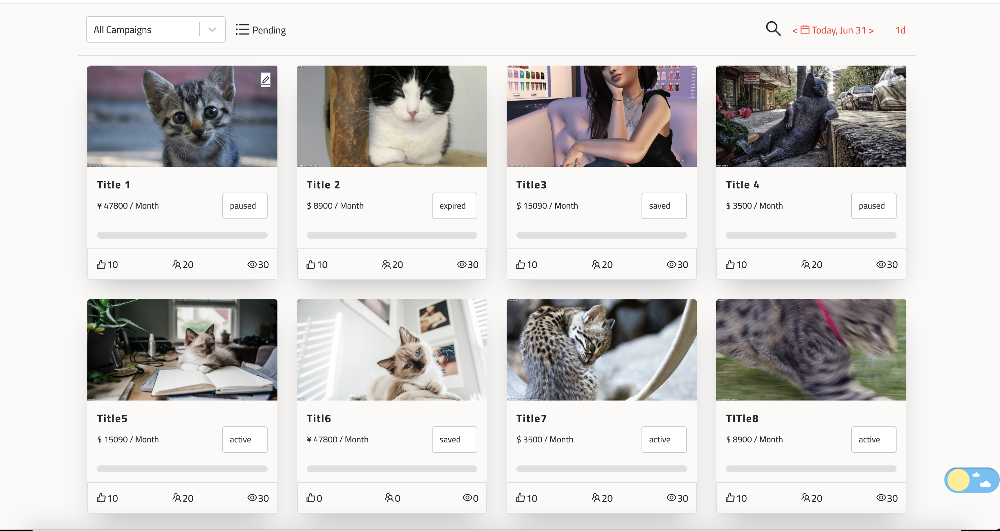
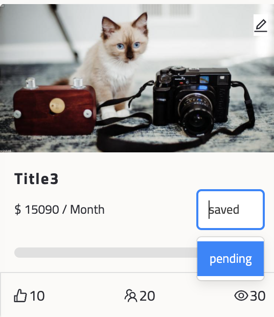
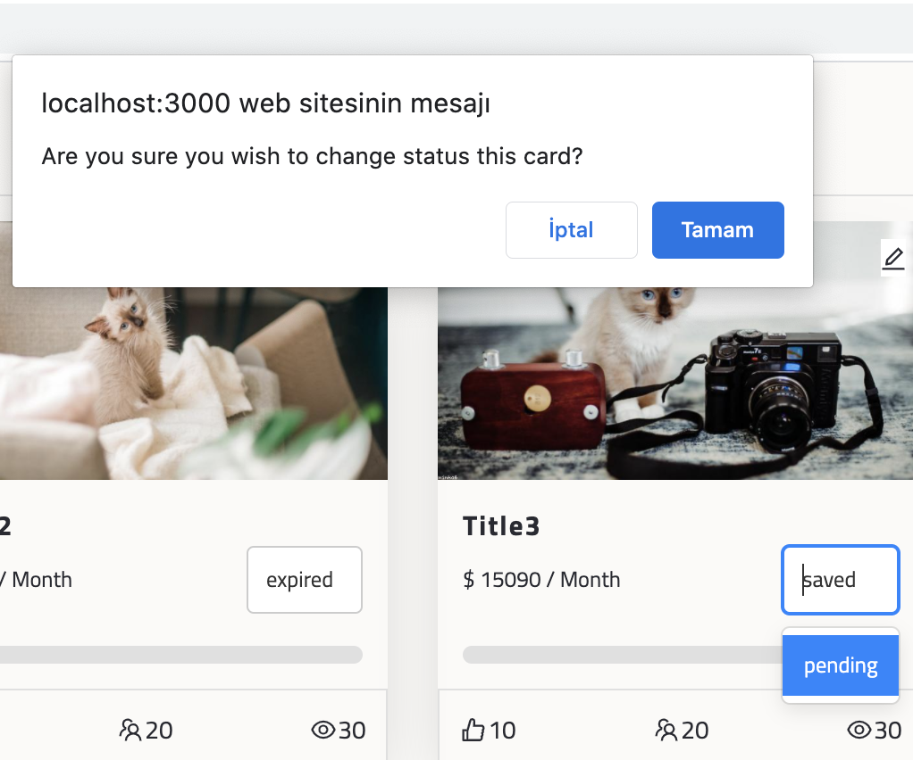
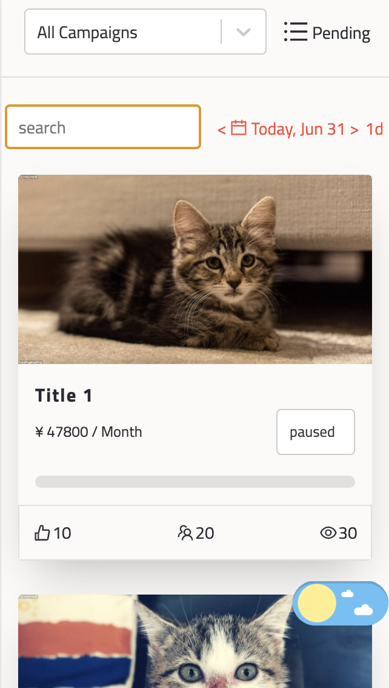
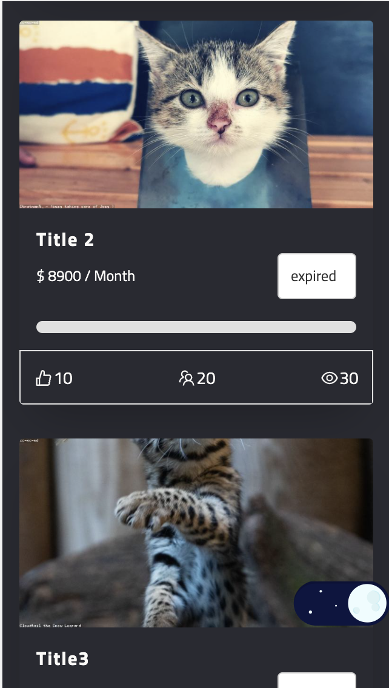

## Dashboard - Introduction

This application demonstrates the React, TypeScript, Redux and Redux-Saga based dashboard having list of services cards

## Table of Contents
- [Technologies Used](#Technologies)
- [Installation](#installation)
- [Folder Structure](#folder-structure)
- [Screenshots](#screenshots)
- [TODO: if this was a real full-time project](#todo)

# Technologies:

- React, TypeScript, Redux-Saga, HTML5, SCSS.
- I didn't use any css library such as bootstrap etc.
- Plugins/Libraries:
  - Redux for stores
  - Redux-saga middleware.
  - Implemented a basic RestApi with express.js
  - TSLint, Prettier for development, verified and indented code.
  - Jest and react-testing-library for tests
  - Axios for api calls
 
- Stack: Create-react-app, Typescript, npm (node modules) etc.
- Engines
    - node: v14.15.4
    - npm : 6.14.10

- This project was bootstrapped with [Create React App](https://github.com/facebook/create-react-app). 
- Express server was bootstrapped with [Express Generator](https://expressjs.com/en/starter/generator.html).

## Installation 

### Backend: 
- open a new terminal
- `cd server/`
- `npm i` for express server
- `npm start` start the server

Server is starting the listen [http://localhost:8080](http://localhost:8080)

### Client: 
- open a new terminal
- `npm i` 
- `npm start`

Runs the app in the development mode.\
Open [http://localhost:3000](http://localhost:3000) to view it in the browser.

### `npm test`
- If I had a more time, I could be able to write more tests

# Folder Structure

- compoments:
    -  This is the folder that stores generic UI components
- actionCreators and actionTypes:
    - I've splitted types and creators into different files 
- config/ :
    - There's only one file and it stores `BASE_URL`(for api request).
     In the real project, I'd like to create base.ts, dev.ts, staging.ts, prod.ts to store config files 
- container/ :
    - Dashboard container for managing api requests, using components etc.
    
- reducers/ :
    - rootReducer.ts is for combine all reducers. In this project, I've tried different way to managing error
     and loading states in shared states  
     
     Instead of writing isLoading and isError into both campaigns and cards state,
     I've created a generics file errorReducer.ts and isLoadingReducer.ts  
     You can check state by using action type
     `isCampaignLoading: state.isLoading[GET_CAMPAIGNS]`
- sagas/ : 
    - redux-saga files for middleware
- services/ : 
    - axios instances
 - store/: 
    - share state with Redux
 - styles/:
    - global styles.scss(dark-mode etc.) and variable.scss (colors etc.)
    
## Screenshots

### All cards without any campaign id filter

### Change card's status. 
I've added a `delay(5000)` into saga middleware to show loading spinner 

### Pop-up a modal to confirm card status changing. 
`Note:` because of time issues I've used window.confirm in here. In the real project, I could create a modal and use it.

### Mobile version (Iphone 5). 
There're some css minor issues. If I've a chance, I'll fix it ASP

### Dark Mode in mobile version. `
`Note: ` I'm using react-select for card's status dropdown. 
It's custom css feature is not efficient so it takes time.
 I'll change the background color on the dark mode

### TODO:
    - Infinity scroll:
        - add limit and offset params to endpoint
        - use intersection observer pattern in the client side
    - Lazy loading could be use on images in that project if the SEO is not so important
    - Improve design
    - There're some bugs that I've known:
        - in the dark mode, campaigns selects background color should be black, and text color  should be white
        - in the dark mode, card's status dropwdown background should be black, and text color  should be white
    - Change express server's folder structure:
        - I've implemented basic version so it should be 
        controller/, routes/, services/
